# TaskbarStats

Een lichtgewicht CPU / GPU / geheugen / netwerk / schijf / batterij / temperatuur-monitor die naast het
systeemvak van de Windows-taakbalk zweeft — zoals TrafficMonitor, maar met waarden die
overeenkomen met Task Manager. Daarnaast een groot bureaublad-dashboard en een fullscreen "cockpit".

## Screenshots

**Taakbalk-widget** — cijfers, meters met per-core-balkjes en batterij, of compact met labels boven:

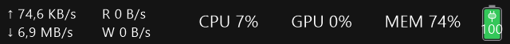
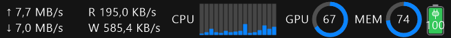
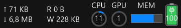

**Rechtermuisknop-menu** (kort, en blijft open terwijl je meerdere dingen kiest) en het **instellingenvenster** met tabbladen
(uiterlijk, kleuren, dashboard, fullscreen, thema's) waarvan elke wijziging direct zichtbaar is:

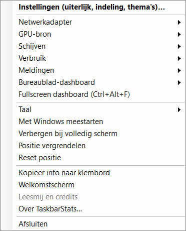
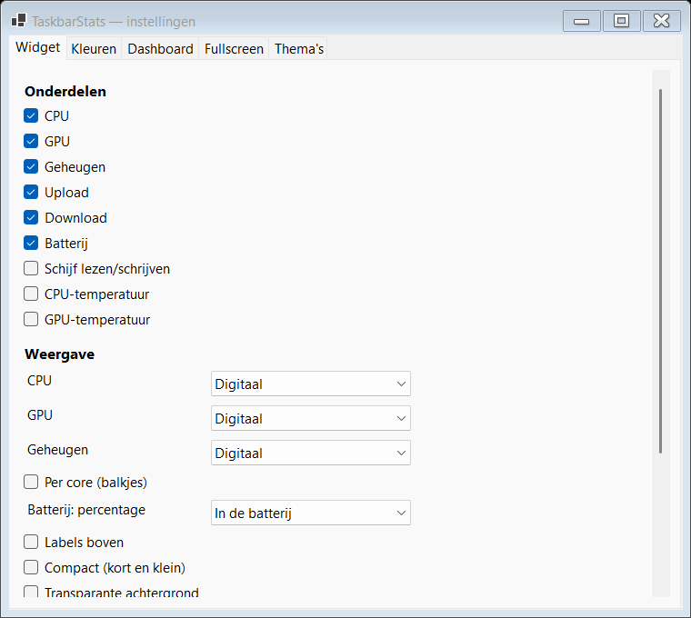
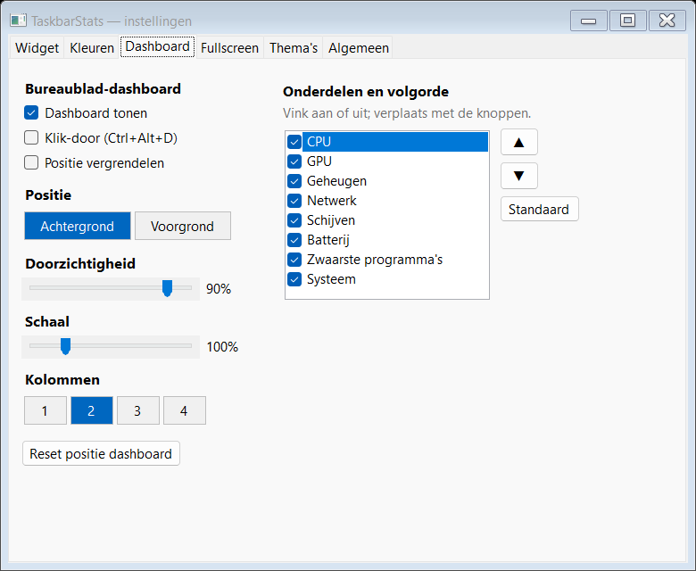
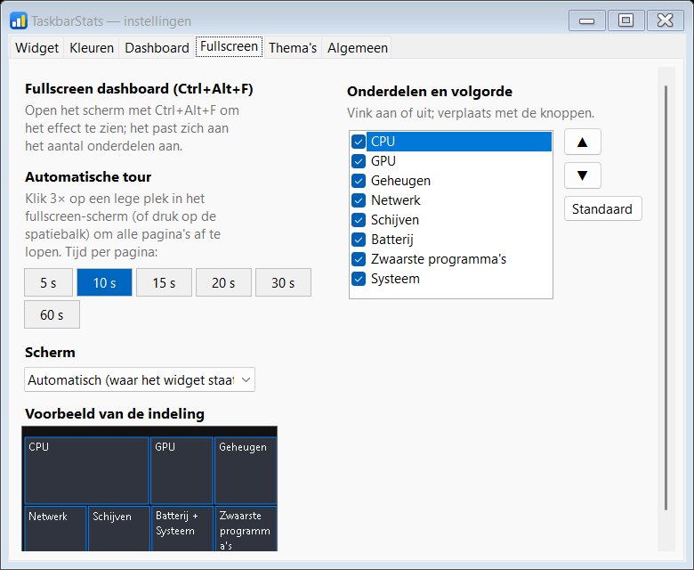
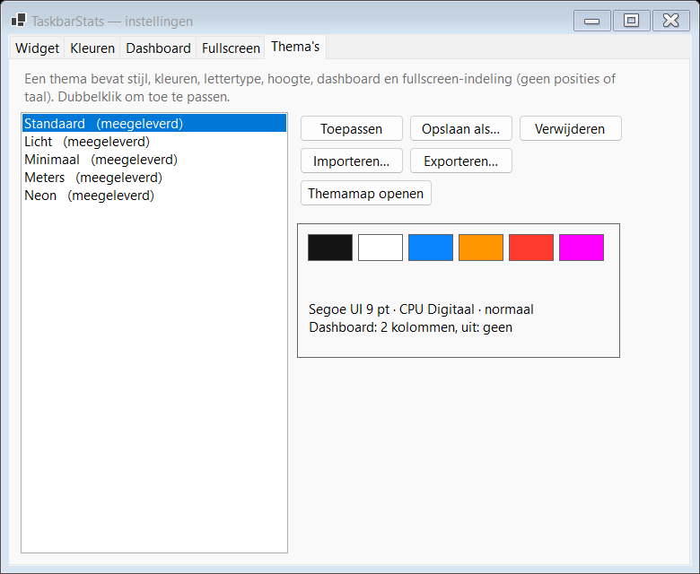

De meegeleverde thema's, hier op het bureaublad-dashboard:

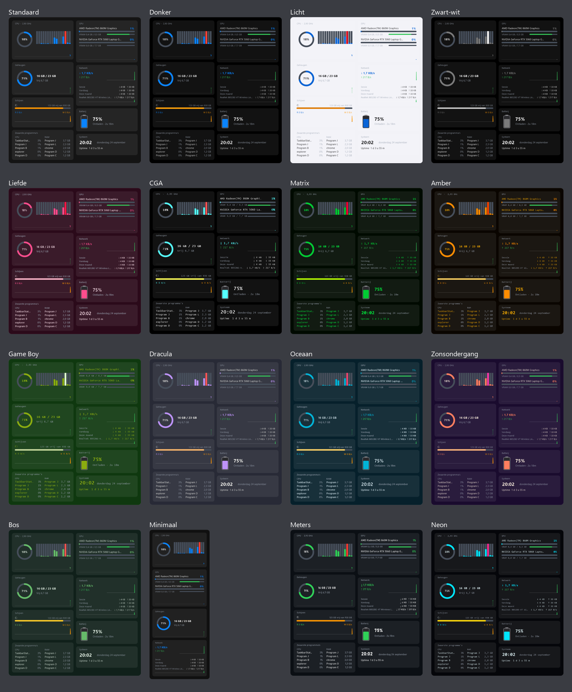

**Bureaublad-dashboard** (halfdoorzichtig, schaalbaar, voor- of achtergrond, klik-door):

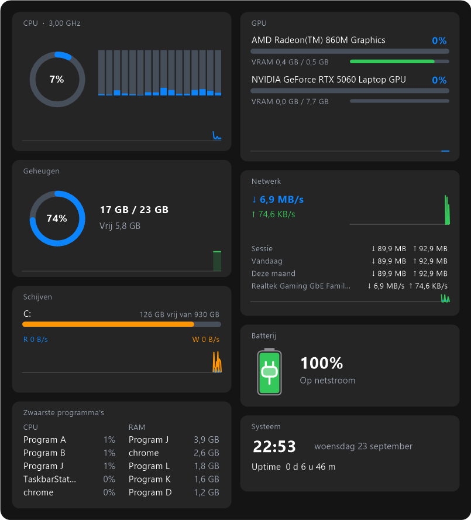

**Fullscreen dashboard** (Ctrl+Alt+F) — overzicht, en klik op een tegel voor details:

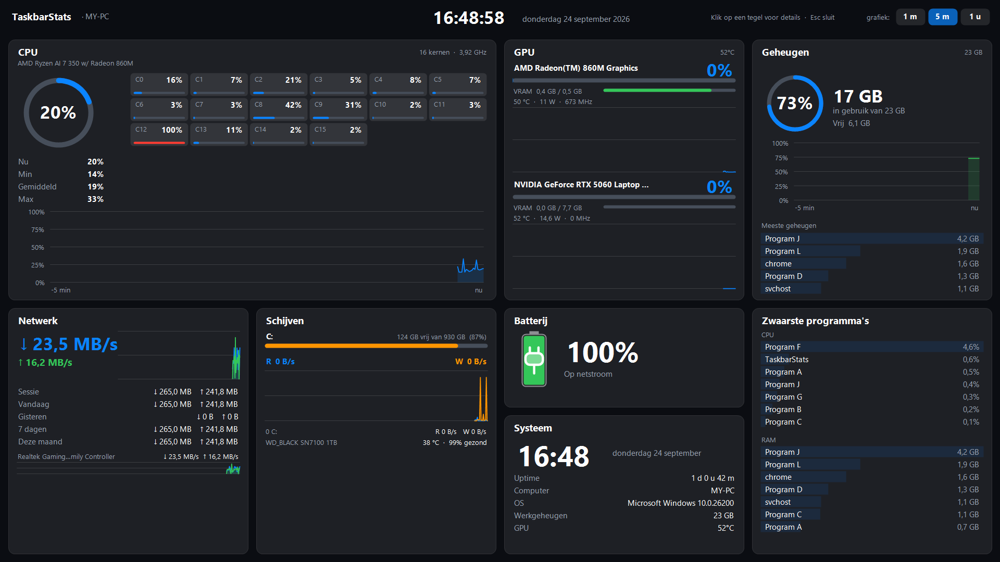
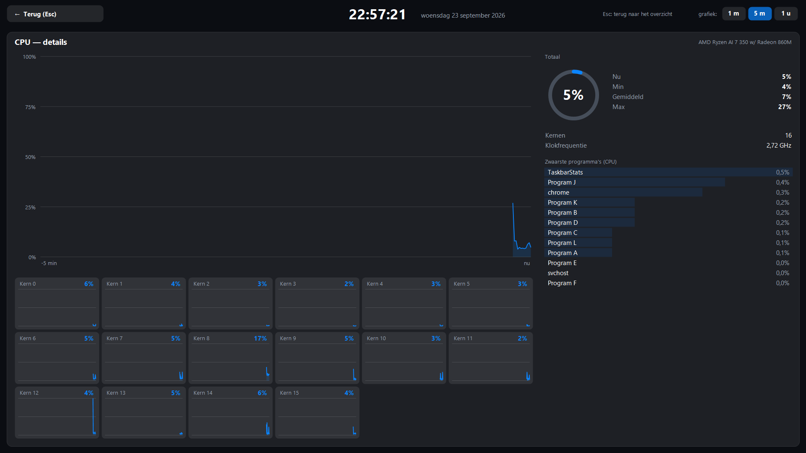
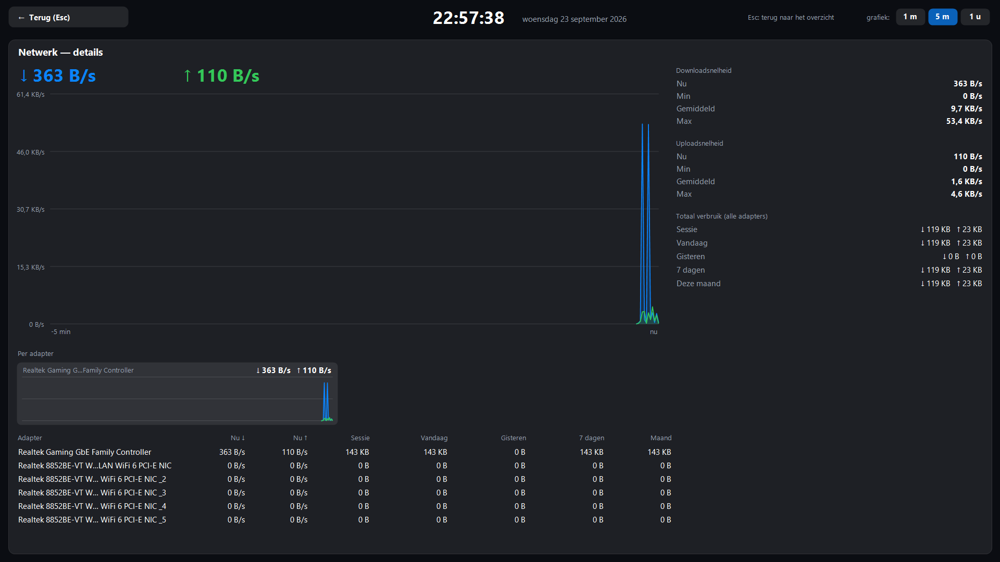
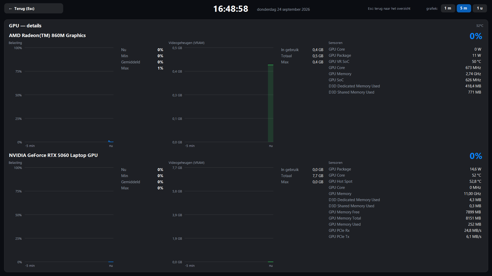
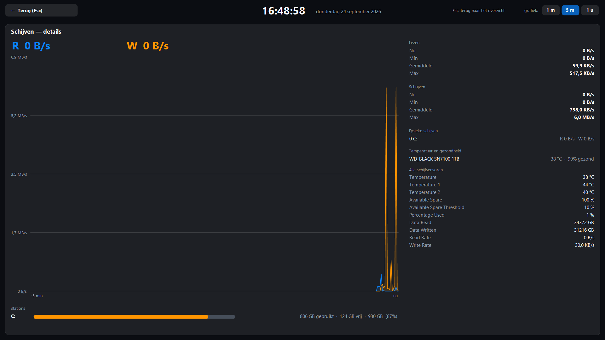
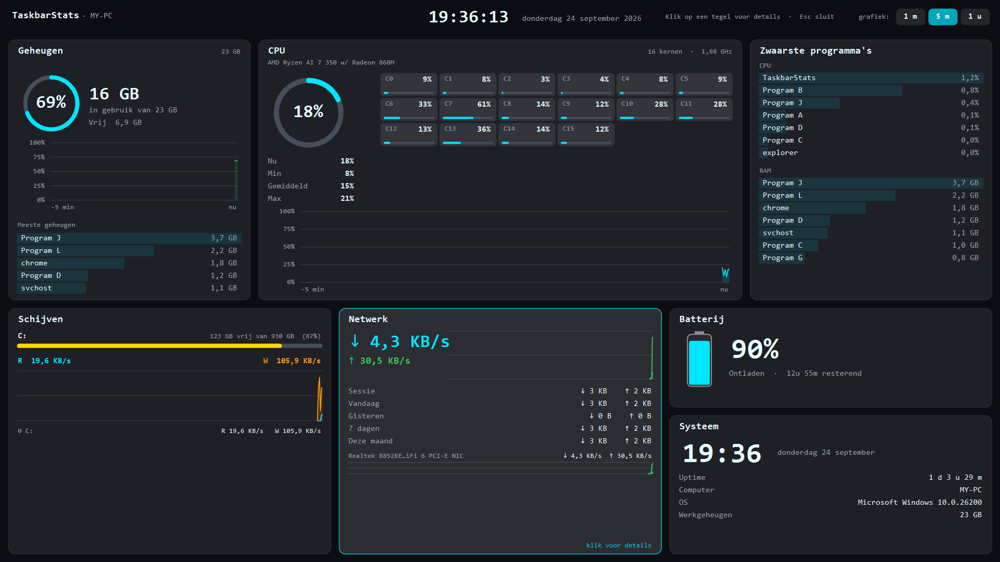

*(Computernaam en programmanamen in de screenshots zijn geanonimiseerd.)*

## Waarom de waarden hier wél kloppen

| Onderdeel | Bron | Waarom correct |
|-----------|------|----------------|
| CPU | `Processor Information\% Processor Utility` (totaal en per core) | Zelfde meting als Task Manager (incl. turbo). Valt terug op `Processor\% Processor Time` als die teller ontbreekt. |
| Geheugen | `GlobalMemoryStatusEx.dwMemoryLoad` | Exact het percentage dat Task Manager toont. |
| GPU | Som van alle `GPU Engine\Utilization Percentage` per GPU (LUID) | Telt 3D + copy + video-engines samen, precies zoals Task Manager. De tellers worden elke 5 s opnieuw opgebouwd omdat engine-instances met processen komen en gaan. |
| Netwerk | `Network Interface\Bytes Received/Sent per sec` | Per adapter of alle adapters samen. |
| Temperatuur | LibreHardwareMonitorLib | CPU/GPU-temperatuur; vereist administrator. |

GPU staat standaard op **automatisch**: het volgt de drukste GPU (handig bij een iGPU +
dGPU). Je kunt ook een vaste GPU kiezen in het menu.

## Bouwen

Vereist: Windows en de .NET 8 SDK (https://dotnet.microsoft.com/download).

Het makkelijkst: dubbelklik **`build.bat`**. Het script

1. vraagt zo nodig zelf om administrator-rechten (nodig om de draaiende app af te sluiten),
2. sluit `TaskbarStats.exe` af als die draait,
3. bouwt een Release-build,
4. start de app daarna weer.

Handmatig kan ook:

```
dotnet build -c Release
```

De `.exe` staat daarna in `bin\Release\net8.0-windows\TaskbarStats.exe`.
Voor één zelfstandig bestand zonder .NET-installatie:

```
dotnet publish -c Release -r win-x64 --self-contained true ^
  -p:PublishSingleFile=true -p:IncludeNativeLibrariesForSelfExtract=true ^
  -p:EnableCompressionInSingleFile=true
```

## Testen zonder je instellingen aan te raken

Twee omgevingsvariabelen laten een testkopie naast de echte app draaien:

| Variabele | Effect |
|-----------|--------|
| `TASKBARSTATS_DATA` | Eigen map voor `settings.json` en `usage.json` (in plaats van `%AppData%\TaskbarStats`). |
| `TASKBARSTATS_INSTANCE` | Achtervoegsel voor de single-instance-mutex, zodat er een tweede instantie kan starten. |

De app vraagt administrator-rechten (`app.manifest`); voor geautomatiseerde tests zet je in een tijdelijke kopie
`requireAdministrator` op `asInvoker`. Zie ook `CLAUDE.md`.

## Installer (Inno Setup)

Eenmalig Inno Setup installeren: `winget install JRSoftware.InnoSetup`
(of https://jrsoftware.org/isdl.php). Daarna dubbelklik je **`build-installer.bat`**: dat
publiceert de app en compileert `installer\TaskbarStats.iss` tot
`installer\Output\TaskbarStats-Setup-<versie>.exe`.

De installer:

- toont eerst het Leesmij (uitleg + credits, `installer\Leesmij.txt`) en installeert het mee;
- maakt een Startmenu-groep met **TaskbarStats**, **Leesmij (uitleg en credits)** en
  **TaskbarStats verwijderen**; optioneel ook een bureaubladsnelkoppeling;
- zet op verzoek autostart aan via een geplande taak met hoogste rechten (geen UAC-melding
  bij het inloggen; de app vraagt admin-rechten en start niet vanuit de Run-sleutel);
- sluit een draaiende versie af bij installeren/verwijderen;
- registreert een uninstaller (ook in Instellingen → Apps) die de taak verwijdert en vraagt of
  je instellingen en verbruikslog (`%AppData%\TaskbarStats`) ook weg mogen.

De app zelf heeft ook "Leesmij en credits" in het rechtermuisknop-menu. Aanpassen van naam,
credits of tekst: `installer\Leesmij.txt` en `#define Publisher` in het `.iss`-bestand.

## Gebruik

Start `TaskbarStats.exe`. Het widget verschijnt als zwevend, altijd-bovenliggend venster
direct links van het systeemvak. Het is eigenaar-venster van de taakbalk, dus het blijft
erboven staan. Sleep met de **linkermuisknop** om het te verplaatsen (de positie wordt
bij loslaten bewaard); het menu heeft "Reset positie".

**Rechtermuisknop** op het widget opent het menu:

- **Instellingen…** (vet, bovenaan) opent het instellingenvenster met tabbladen. Elke wijziging wordt direct toegepast en bewaard:
  - *Widget*: onderdelen (CPU, GPU, geheugen, up-/download, batterij, schijf, temperaturen), weergave per onderdeel (digitaal, meter of balk; CPU per core), batterijpercentage, labels boven, compact, transparant, hoogte, lettertype/-grootte en ververssnelheid.
  - *Kleuren*: tekst, achtergrond, meter/balk, waarschuwing, kritiek, rand en drempels (bv. 85% / 95%).
  - *Dashboard*: tonen, voor-/achtergrond, klik-door, vergrendelen, doorzichtigheid, schaal, kolommen, en **volgorde en aan/uit per hoofdonderdeel**.
  - *Fullscreen*: welk scherm, en volgorde en aan/uit per hoofdonderdeel (het scherm past zich aan het aantal onderdelen aan).
  - *Thema's*: meegeleverde thema's (16 stuks: Standaard, Donker, Licht, Zwart-wit, Liefde, CGA, Matrix, Amber, Game Boy, Dracula, Oceaan, Zonsondergang, Bos, Minimaal, Meters, Neon), je eigen thema opslaan, laden, verwijderen, importeren en exporteren (zie hieronder).
- **Netwerkadapter** en **GPU-bron**: achter elke adapter en GPU staat de actuele snelheid/het gebruik (live bijgewerkt terwijl het menu openstaat). GPU's worden met naam getoond.
- **Schijven**: lees/schrijfsnelheid per fysieke schijf (live), vrije/totale ruimte per station, en een keuze wat het widget toont: uit, totaal, alle schijven apart of één schijf. De totale lees/schrijfsnelheid zet je aan via *Onderdelen → Schijf lezen/schrijven*.
- **Tooltip**: houd de muis boven het widget voor alle details (RAM in GB, per-GPU, netwerk per adapter, schijven en schijfruimte, temperaturen).
- **Verbruik**: ontvangen/verzonden per netwerkadapter (sessie, vandaag, gisteren, 7 dagen, maand), een log per dag met CSV-export en een instelbare maandlimiet.
- **Meldingen**: bijna volle schijf, langdurig hoge belasting, lage batterij, maandlimiet.
- **Batterij** (laptops): staande batterij met niveau, kleur en bliksem/stekker; percentage in, naast of uit.
- **Positie vergrendelen**, **Verbergen bij volledig scherm**, **Reset positie**, **Taal** (NL/EN).
- **Met Windows meestarten** (geplande taak, geen UAC-melding) en **Afsluiten**.

Verder: dubbelklik opent Taakbeheer, de middelste muisknop kopieert de tooltip-informatie
naar het klembord, en bij de eerste start verschijnt een welkomstscherm.

Het menu blijft open als je een optie aanklikt, zodat je meerdere dingen achter elkaar kunt
instellen. Het sluit als je buiten het menu klikt, Esc drukt, of de muis ongeveer een
seconde niet meer boven het menu (of een submenu) is.

Er draait maar één instantie tegelijk.

## Bureaublad-dashboard en fullscreen

**Bureaublad-dashboard** (instellingen → *Dashboard*, of menu *Bureaublad-dashboard*; standaard uit): een groot, halfdoorzichtig venster met tegels
(CPU met per-core-balkjes, GPU per kaart met VRAM, geheugen, netwerk met een minigrafiekje per adapter, schijven,
batterij, zwaarste programma's, systeem) en grafiekjes van de laatste 5 minuten. Alles is los aan/uit te zetten;
verder instelbaar: voorgrond of achtergrond, schaal 50–300%, doorzichtigheid, 1–4 kolommen, vergrendelen en **klik-door**
(kliks gaan erdoorheen; **Ctrl+Alt+D** of dubbelklik op het pictogram bij de klok zet dat aan/uit, want dan werkt
rechtsklikken niet meer). Het blijft staan als je "Bureaublad weergeven" gebruikt.

**Fullscreen dashboard** (**Ctrl+Alt+F**, of menu *Fullscreen dashboard*): één dicht overzicht van alles op een heel scherm
(kiesbaar welk). Klik op een tegel voor de diepgaande weergave (grafiek tot 1 uur, min/gemiddeld/max, per kern, per GPU
met VRAM, per adapter, per schijf, top-programma's, systeeminfo); **Esc** gaat terug en sluit vanuit het overzicht.
Toets **1/2/3** kiest de grafiek: 1 min / 5 min / 1 uur.

**Sensoren** (LibreHardwareMonitor, alleen actief zolang het fullscreen-scherm open is): CPU-vermogen, -temperaturen en -klokken,
GPU-temperatuur/-vermogen/-klok/-ventilator per kaart, schijftemperatuur en -gezondheid (SMART), hoofdbord en ventilatoren,
geheugen en batterij. Voor CPU, hoofdbord en schijven zijn administrator-rechten nodig (de app vraagt die al); zonder
die rechten toont het scherm de sensoren die wel beschikbaar zijn (GPU, geheugen, batterij) en een korte uitleg.

**Volgorde en onderdelen**: in het instellingenvenster (tab *Dashboard* of *Fullscreen*) zet je de hoofdonderdelen (CPU, GPU, geheugen, netwerk, schijven, batterij, zwaarste programma's, systeem) aan of uit en verplaats je ze met de pijlknoppen. Het bureaublad-dashboard vult zijn kolommen in die volgorde; het fullscreen-scherm vult rijen van vier kolommen (CPU is twee breed; batterij en systeem delen een cel) en past de breedte aan.

**Thema's**: een thema is een klein JSON-bestand met stijl, kleuren, lettertype, hoogte, dashboard- en fullscreen-indeling (geen posities of taal). Eigen thema's staan in `%AppData%\TaskbarStats\themes\` en zijn te delen: exporteer een thema en geef het bestand door, de ander importeert het.

**Netwerkschijven** (gekoppelde stations) neem je mee via *Schijven → Netwerkschijven meenemen*; ze worden op de
achtergrond opgevraagd, zodat een onbereikbare share de app niet vertraagt.

## Instellingen

Opgeslagen in `%AppData%\TaskbarStats\settings.json` (overleeft herbouw en
herinstallatie). Wijzigingen via het menu worden direct bewaard. Ook handmatig aan te
passen: `FontFamily`, `FontSize`, `WidgetHeight`, `TrayGap`, kleuren en drempels.

## Transparante achtergrond

Het venster is een *layered window* met per-pixel alpha. Bij "transparant" wordt de
achtergrond met alpha 1 getekend: onzichtbaar, maar nog steeds klikbaar. (Een
`TransparencyKey` liet klikken op de doorzichtige delen door naar het venster eronder,
waardoor het rechtermuisknop-menu soms niet verscheen.)

## Administrator-rechten

De app vraagt om administrator-rechten (via `app.manifest`). Dat is nodig voor de
temperatuur-sensoren (LibreHardwareMonitorLib). Heb je die niet nodig, dan mag je in
`app.manifest` `requestedExecutionLevel` op `asInvoker` zetten; temperatuur werkt dan niet.

## Automatisch starten met Windows

Gebruik "Met Windows meestarten" in het menu, of de optie in de installer. Dit maakt een
geplande taak "bij inloggen" met hoogste rechten aan, zodat er geen UAC-melding komt.

## Code-overzicht

| Bestand | Rol |
|---------|-----|
| `src/Program.cs` | Startpunt, single-instance mutex, `--autostart-on/off` voor de installer. |
| `src/WidgetForm.cs` | Het taakbalk-widget: tekenen naar een ARGB-bitmap (`UpdateLayeredWindow`), muis, menu, tooltip, meldingen, sneltoetsen, sampler-thread. |
| `src/Metrics.cs` | Prestatietellers (PDH-wildcard voor GPU), geheugen, batterij, temperatuur, DXGI-GPU-namen. |
| `src/DashboardForm.cs` | Bureaublad-dashboard + `MetricHistory`/`Ring` (grafiekgeschiedenis) en `DashContext`. |
| `src/FullscreenForm.cs` | Fullscreen "cockpit": dicht overzicht en detailweergaven per tegel. |
| `src/UsageTracker.cs` | Netwerkverbruik per adapter en per dag (`usage.json`), thread-veilig. |
| `src/ProcessSampler.cs` | Zwaarste processen (asynchroon bemonsterd). |
| `src/AppSettings.cs` | Instellingen (JSON). |
| `src/TaskbarHost.cs` | Zoekt de positie van het systeemvak/de taakbalk. |
| `src/StartupManager.cs` | Autostart via een geplande taak (hoogste rechten). |
| `src/SettingsForm.cs`, `src/Themes.cs`, `src/Tiles.cs` | Instellingenvenster met tabbladen (live toegepast), thema's (meegeleverd + eigen JSON-bestanden), onderdelen-ids/volgorde. |
| `src/LogForm.cs` | Venster met het verbruikslog. |
| `src/WelcomeForm.cs`, `src/AboutForm.cs` | Welkomstscherm en Over-venster. |
| `src/Loc.cs` | Nederlandse/Engelse teksten (`Loc.Pick`). |

## Prestaties en threads

De UI-thread doet alleen tekenen en menu's; het zware werk zit elders:

- Een **sampler-thread** leest de metingen (`Metrics.Update`) en houdt het verbruik bij (`UsageTracker.Sample`);
  de UI tekent met de laatste waarden. Gedeelde gegevens zijn thread-veilig (vergrendeld of atomair vervangen).
- **GPU, netwerk en CPU-cores** gaan via één PDH-query met jokerteken per teller (bv. `\GPU Engine(*)\Utilization Percentage`), niet via
  losse `PerformanceCounter`-objecten (GPU kostte 150–780 ms per tik; het netwerk ging van ~39 naar ~7 ms).
- **Zuinig**: bij een verborgen widget zonder dashboard/fullscreen wordt maar om de 5 s gemeten, het verbruik wordt om de 5 s bijgewerkt, de werkset wordt regelmatig teruggegeven aan Windows en de runtime draait zonder extra GC-thread. Gemeten in rust: ~2% van één kern en ~60 MB werkset (was ~2–5% en ~93 MB).
- Het widget staat niet elke 200 ms opnieuw bovenop (`SetWindowPos` op een venster van de taakbalk kan 100+ ms blokkeren);
  dat gebeurt alleen als er echt een ander zichtbaar topmost-venster overheen staat.
- Programma's bemonsteren (`ProcessSampler.SampleAsync`) en netwerkschijven (`DriveInfo`) draaien op de achtergrond.

## Licentie en credits

MIT-licentie (zie [LICENSE](LICENSE)): je mag TaskbarStats vrij gebruiken, aanpassen en delen,
ook voor eigen projecten. De enige voorwaarde is dat de copyrightregel en de licentietekst
behouden blijven — laat dus graag de credits staan. Bedankt!

Het programma gebruikt LibreHardwareMonitorLib (MPL-2.0), HidSharp (Apache-2.0) en .NET (MIT);
die vallen onder hun eigen licenties.
